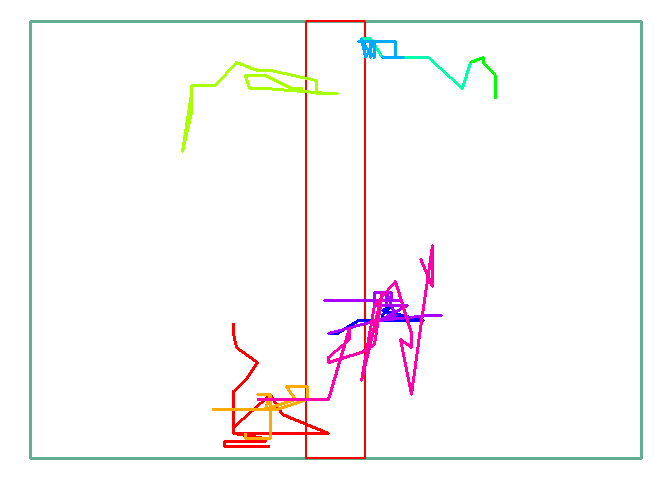

Cross testing
================
Lukáš ‘hejtmy’ Hejtmánek
12/01/2020

# Crosses testing

Due to the issues with the software, it is necessary to redefine the
number of crosses slightly differently. The main issue is the animal
“peeking” out into the zone but not actually visiting it. We then end
up with much higher number of crosses than intended. The way to
circumwent this is to set a central zone in which the “cross” doesn’t
count. This is how the Arena then looks

<!-- -->

The zone in the middle is the “noman’s zone”, where the cross doesn’t
count as a cross. The animal needs to cross from either of the grey
areas to count as a cross.

The following tracks are therefore considered crosses:
<!-- -->

Whereas these tracks would not be counted as middle crosses, although
they might cross the midline
<!-- -->

The weird plotting - eg. the seemingly overalapping tracks in the top
and the track in the bottom which eventually crosses to the left are due
to the plotting, not calculation (I am plotting approx 1s around the
cross, therefore if the mouse crosses the boundary multiple times, final
lines are overlapping. Same goes for the eventual cross, which is due to
a single there and back movement and then eventual cross to the other
side - same track (here in pink) can be seen in the lime green in the
graph above)
